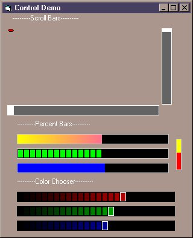



## ActiveX Horizontal And Vertical Gradient Controls

### Description

Two Multipurpose Gradient Controls. Use for Scroll Bars, Percentage Bars, or Value Pickers.

Totally customizable to fit the look of your application. Includes source code, ocx's and demo program.
 
### More Info
 

             |
---                |---
**Submitted On**   |2000-11-13 02:05:00
**By**             |[Da' Booda](https://github.com/Planet-Source-Code/PSCIndex/blob/master/ByAuthor/da-booda.md)
**Level**          |Advanced
**User Rating**    |4.8 (24 globes from 5 users)
**Compatibility**  |VB 5\.0
**Category**       |[OLE/ COM/ DCOM/ Active\-X](https://github.com/Planet-Source-Code/PSCIndex/blob/master/ByCategory/ole-com-dcom-active-x__1-29.md)
**World**          |[Visual Basic](https://github.com/Planet-Source-Code/PSCIndex/blob/master/ByWorld/visual-basic.md)
**Archive File**   |[CODE\_UPLOAD1163611132000\.zip](https://github.com/Planet-Source-Code/da-booda-activex-horizontal-and-vertical-gradient-controls__1-12754/archive/master.zip)

